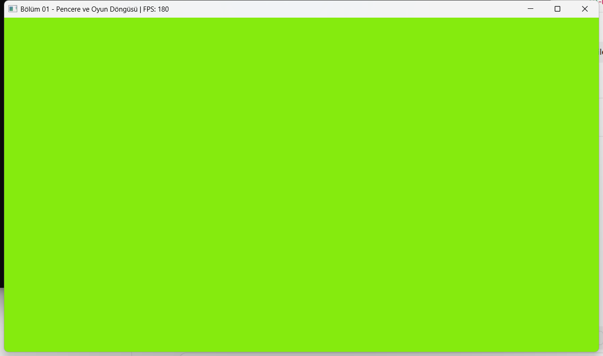

# Bölüm 01 — Pencere ve Oyun Döngüsü



## 1. Bu bölümde ne yaptık

Bir pencere açtık, içine OpenGL 3.3 bağlamı kurduk ve rengi yumuşakça değişen bir arka plan
çizdik. Daha önemlisi, motorun kalbini kurduk: **oyun döngüsünü**. Döngü fiziği her
bilgisayarda aynı davranacak şekilde **sabit zaman adımıyla** ilerletiyor. Bunu konsolda
görebilirsin: FPS 80 ile 180 arasında oynarken "sabit adım" sayısı hep 60 civarında kalıyor.

Programı çalıştırmak için: README'deki "Nasıl derlenir ve çalıştırılır" bölümüne bak, sonra
`example_01_window.exe`'yi aç.

## 2. Derleme altyapısı

**CMake** bir derleme sistemi *üreticisidir*. Kodu kendisi derlemez; `CMakeLists.txt`
dosyalarını okuyup Visual Studio'nun anlayacağı proje dosyalarını üretir. Avantajı: aynı
`CMakeLists.txt` Linux'ta Makefile, Windows'ta Visual Studio projesi üretebilir.

Projede üç tür hedef (target) var:

| Hedef | Türü | Ne işe yarar |
|---|---|---|
| `engine` | statik kütüphane | Motorun kendisi. Tek başına çalışmaz, programlara "yapıştırılır". |
| `example_01_window` | program | Motoru kullanan Bölüm 01 örneği. |
| `engine_tests` | program | Birim testleri. |

**CMakePresets.json:** Configure ayarlarını bir dosyaya yazdık, böylece uzun komutları
ezberlemek gerekmiyor. Derleme klasörü `C:\dev\build\learning-game-engine\msvc`. Proje
OneDrive'da durduğu için derleme çıktılarını (yüzlerce MB) oraya koymuyoruz, yoksa OneDrive
her derlemede onları senkronlamaya çalışırdı.

**FetchContent:** GLFW ve doctest'i elle indirip kurmadık. CMake ilk configure sırasında
onları GitHub'dan belirli bir sürümle (`GIT_TAG 3.4`) kendisi indirdi. Herkes aynı sürümü
kullanır, "bende çalışıyor" sorunu olmaz.

**glad neden repoda?** Windows'un `opengl32.dll` dosyası yalnızca 1997'den kalma OpenGL 1.1
fonksiyonlarını (ör. `glClear`) doğrudan sunar. Modern fonksiyonlar (ör. `glCreateShader`,
`glGenBuffers`) ekran kartı sürücüsünün içinde yaşar. Programın, çalışırken bu fonksiyonların
adreslerini sürücüden sorması gerekir; glad bu işi yapan koddur. glad'ı bir Python aracıyla bir kez
ürettik ve `external/glad/` altına koyduk. Böylece derlemek için Python gerekmiyor.

## 3. Oyun döngüsü

Her oyun özünde şu döngüdür:

```
           ┌────────────────────────────────────────────┐
           │  dt = son kareden bu yana geçen süre       │
           │       (en fazla 0.25 sn ile sınırlanır)    │
           │                                            │
           │  1) onFixedUpdate(1/60)  × (0, 1, 2… kez)  │  ← fizik, oyun kuralları
           │  2) onUpdate(dt)                           │  ← animasyon, input tepkisi
           │     onRender()                             │  ← çizim
           │  3) swapAndPoll()                          │  ← kareyi göster, olayları işle
           └──────────────────┬─────────────────────────┘
                              └── pencere açık olduğu sürece tekrar
```

### Değişken dt neden fizikte sorun?

Bir topu yerçekimiyle düşürelim (g = 10 m/s²). Her karede `hız += g·dt; konum += hız·dt`
yapıyoruz. 1 saniye sonra top ne kadar düşmüş olmalı? Gerçekte 5.00 m.

| FPS | dt | 1 sn sonra düşülen mesafe |
|---|---|---|
| 30 | 0.033 sn | 5.17 m |
| 144 | 0.007 sn | 5.03 m |

Aynı oyun, iki bilgisayarda farklı sonuç! Zıplama yüksekliği değişir. Yavaş bilgisayarda
büyük dt yüzünden top tek karede duvarın içinden geçebilir.

### Çözüm: biriktirici (accumulator)

Gerçek zamanı bir kovaya dök. Kovada 1/60 sn'lik dolu bir "adım" oldukça fiziği **tam
1/60 sn** ilerlet, sonra o adımı kovadan çıkar. Artan süre bir sonraki kareye kalır.

- 180 FPS'te (dt ≈ 0.0056 sn) çoğu karede kova dolmaz → 0 adım. Yaklaşık her 3 karede 1 adım.
- 30 FPS'te (dt ≈ 0.033 sn) her karede 2 adım.
- Her iki durumda da saniyede tam 60 adım çalışır ve fizik hep aynı sonucu verir.

Kod: `engine/core/FixedTimestep.cpp` → `advance()`.

### Kare süresini 0.25 saniyeyle sınırlamak

`FixedTimestep::clampFrame()` tek bir karenin en fazla **0.25 saniye** sayılmasını sağlar.
Bu sınır iki ayrı soruna çözüm:

**(a) Tek seferlik donma.** Debugger'da breakpoint'te 10 saniye bekledin, ya da Windows'ta
pencereyi sürüklerken döngü durdu. Sınır olmasaydı bir sonraki karede kovada 10 saniye olur,
fizik 600 adımı art arda çalıştırır ve dünya bir anda 10 saniye ileri sıçrardı: düşmanlar
ışınlanır, top duvarları aşardı. Sınırla birlikte en fazla 0.25 sn (15 adım) çalışır, kalan
9.75 sn **atılır**. Oyun küçük bir sıçramayla kaldığı yerden devam eder. Aynı sınırlı dt
`onUpdate`'e de verilir, böylece animasyonlar da sıçramaz.

**(b) Asıl "ölüm sarmalı" (spiral of death).** Bu, **bir fizik adımını hesaplamak, simüle
ettiği süreden (1/60 sn) daha uzun sürdüğünde** olur. Mesela sahnede çok nesne var ve bir adım
20 ms sürüyor. Her adım, kendi simüle ettiğinden (16.7 ms) daha fazla gerçek zaman harcıyor.
2 adımlık bir kare 40 ms sürer ve bu sürede 2.4 adımlık zaman birikir. Birkaç kare sonra 3, sonra
4, 5… adım gerekir. Her kare bir öncekinden daha uzun sürer ve oyun donar. Sınır, kare başına adım sayısını en fazla 15'e kilitler. Oyun zamanı gerçek zamandan
yavaş akar (**ağır çekim**) ama asla donmaz.

### NaN tuzağı

`NaN` ("sayı değil") ile yapılan `<`, `>`, `<=`, `>=` ve `==` karşılaştırmalarının **hepsi
`false`** döner: `NaN > 0`, `NaN < 0`, hatta `NaN == NaN` bile `false`. Tek istisna `!=`:
`NaN != NaN` **`true`** döner. (Bu yüzden `x != x` ifadesi yalnızca `x` NaN ise doğrudur.) Kovaya bir kez NaN girerse kova sonsuza dek NaN kalır,
`kova >= adım` hiç doğru olmaz ve oyun sessizce durur. Bu yüzden kontrolü
`if (dt < 0)` diye değil `if (!(dt > 0))` diye yazdık. İkincisi NaN'ı da yakalar.

## 4. C++ köşesi

**RAII (Resource Acquisition Is Initialization).** "Kaynağı kurucuda al, yıkıcıda bırak."
`Window` nesnesi oluştuğunda pencere açılır; nesne kapsamdan çıktığında (ör. `main` bitince)
yıkıcı `~Window()` otomatik çalışır ve pencereyi kapatır. "Kapatmayı unutmak" imkânsızdır.
Bu deseni motorun her yerinde (shader, texture, buffer) kullanacağız.

**`= delete` ile kopyalamayı yasaklamak.**
```cpp
Window(const Window&) = delete;
Window& operator=(const Window&) = delete;
```
`Window a(...); Window b = a;` yazılabilseydi `a` ve `b` aynı pencereyi gösterirdi. İkisinin
yıkıcısı da onu kapatmaya çalışır ve ikincisi zaten silinmiş bir pencereyi silerdi (çökme).
`= delete` derleyiciye "bu fonksiyonu üretme" der; kopyalama denemesi **derleme hatası** olur.

**İleri bildirim (forward declaration).** `Window.h` içinde `#include <GLFW/glfw3.h>` yerine
sadece `struct GLFWwindow;` yazdık. Derleyiciye "böyle bir tip var" demek, işaretçisini
(`GLFWwindow*`) tutmak için yeterli. Böylece `Window.h`'yi dahil eden herkes GLFW'nin dev
başlığını da dahil etmek zorunda kalmıyor ve derleme hızlanıyor.

**`virtual` ve `override`.** `Application` içindeki `virtual void onRender()` "türetilmiş
sınıf bunu değiştirebilir" demek. `WindowDemo` içindeki `void onRender() override` ise
"taban sınıftaki fonksiyonu değiştiriyorum" demek. İsmi yanlış yazarsan (`onRendr`)
`override` sayesinde derleyici hata verir.

**Neden `virtual ~Application()`?** Bir gün `Application* app = new Breakout(); delete app;`
yazarsak ve yıkıcı virtual değilse, C++ standardına göre bu **tanımsız davranıştır**
(undefined behavior). Pratikte genellikle yalnızca `~Application()` çalışır ve `Breakout`'un
temizliği atlanır, ama her şey olabilir. Taban sınıf olarak tasarlanan her sınıfın yıkıcısı virtual olmalıdır.

**Üye kurulum sırası.** Üyeler, kurucudaki yazılış sırasına göre değil, **sınıfta bildirildikleri
sırayla** kurulur. Bu yüzden `Application`'da `m_baseTitle`, `m_window`'dan önce bildirildi.

**Makrolar ve `__FILE__` / `__LINE__`.** `LOG_INFO("...")` bir fonksiyon değil makro.
Ön işlemci (preprocessor) onu çağrıldığı yerde metin olarak açar; `__FILE__` ve `__LINE__`
o noktanın dosya adı ve satır numarasıyla değiştirilir. Bir fonksiyon kendisini kimin
çağırdığını bu kadar kolay bilemezdi.

**`static` yerel değişken.** `Log.cpp`'deki `static const ConsoleSetup setup;` satırı fonksiyon
ilk çağrıldığında **bir kez** çalışır, sonraki çağrılarda aynı nesne kullanılır. Konsolu
UTF-8'e almayı bu şekilde yalnızca bir kez yapıyoruz.

## 5. Kodda gezinti

Okuma sırası önerisi:

1. `examples/01_window/main.cpp` — motoru kullanan taraf. Neye ihtiyacımız olduğunu görürsün.
2. `engine/core/Application.h/.cpp` — `run()` döngüsü.
3. `engine/core/FixedTimestep.h/.cpp` — biriktirici.
4. `engine/core/Window.h/.cpp` — GLFW, OpenGL bağlamı, glad.
5. `engine/renderer/RenderCommand.h/.cpp` — OpenGL'e açılan en ince kapı.
6. `engine/core/FpsCounter.h/.cpp`, `engine/core/Log.h/.cpp` — yardımcılar.
7. `tests/` — her sınıfın nasıl davranması gerektiğinin "yaşayan belgesi".

## 6. Testler

Ekran gerektirmeyen her şeyi (log biçimi, sabit adım, FPS) **önce test** yazarak geliştirdik:

1. **Kırmızı:** Test yazıldı ve derlenmeye çalışıldı. Derleme başarısız oldu
   (`FixedTimestep.h bulunamadı`), çünkü test edilen kod henüz yoktu.
2. **Yeşil:** Testi geçirecek en sade kod yazıldı ve testler geçti.

Önce kırmızıyı görmek önemli: hiç başarısız olmadığını gördüğün bir test, gerçekten bir şeyi
test ettiğini kanıtlamaz.

Testlerde 0.25, 0.125, 0.625 (= 5/8) gibi sayılar seçtik. Bunlar **paydası 2'nin kuvveti olan
kesirler** olduğu için `float`'ta **tam** temsil edilir. 0.1 gibi bir sayı ise float'ta 0.100000001490116… olarak saklanır ve
toplamalarda küçük hatalar birikir.

Konsolda ilk satırda `FPS: 0` görmen de normal. Örnek programın "1 saniye" sayacı ile FPS
sayacı aynı dt'leri topluyor, yani 1 saniyeyi **aynı karede** dolduruyorlar. Ama o karede
`onUpdate` (rapor) FPS sayacının güncellenmesinden önce çalışıyor. Bu yüzden ilk rapor henüz
hesaplanmamış 0'ı, sonraki her rapor da bir önceki saniyenin FPS'ini gösteriyor.

## 7. Alıştırmalar

a. `examples/01_window/main.cpp` içinde `config.window.vsync = false;` ekle. FPS ne oldu?
   Sabit adım sayısı değişti mi? Neden?

b. `config.fixedStep = 1.0f / 30.0f;` yap. Konsoldaki adım sayısı neden 30'a düştü?
   Bir yarış oyununda fiziği 30 Hz'de çalıştırmanın dezavantajı ne olurdu?

c. Programı çalıştır ve pencereyi başlığından tutup 2–3 saniye sürükle, sonra bırak. Konsolda
   o saniye için kaç adım gördün? Bunu 0.25 saniyelik sınırla (bölüm 3, madde a) açıkla.

d. `tests/test_fixed_timestep.cpp` dosyasına kendi testini yaz: adım 0.25 sn, art arda
   3 kare × 0.1 sn. Kaç adım bekliyorsun? Testi çalıştır.
   (İpucu: `ctest --preset debug` veya doğrudan `engine_tests.exe`.)

e. (Zor) `Application::run()` içinde `dt`'yi `onUpdate`'e vermeden önce 2 ile çarparak oyunu
   "2x hızlı" çalıştır. Hangi satırları değiştirmen gerekti? Sabit adım hâlâ doğru mu?

## 8. Sırada ne var

**Bölüm 02 — Shader'lar ve ilk üçgen.** GPU'ya köşe (vertex) verisi göndereceğiz, ilk vertex
ve fragment shader'larımızı yazacağız ve RAII'nin bir adım ötesine, *taşıma (move)
semantiğine* geçeceğiz.
